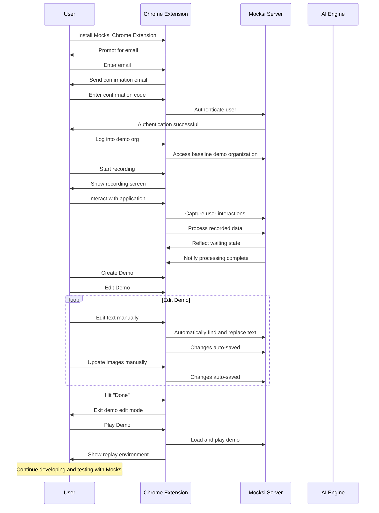

# Mocksi Product Flow

Below is a sequence diagram that illustrates the interaction flow between a user, the Mocksi Chrome Extension, the Mocksi Server, and the AI Engine. 

This diagram provides a step-by-step visualization of the process from installing the extension to creating, editing, and playing a demo. 

